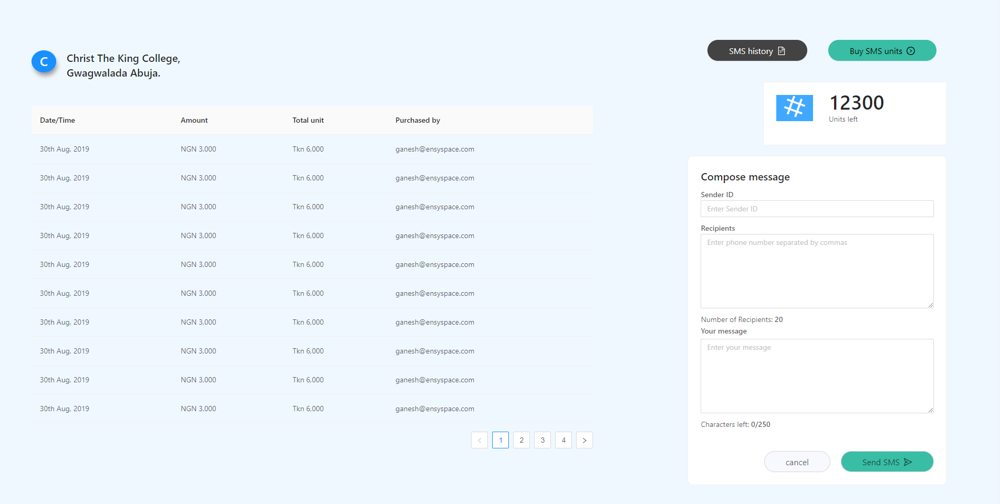

# ant-design

Mock up conversion using Ant Design UI library

<p align="center">
  
</p>

## Development

To get a local copy of the code, clone it using git:

```
git clone https://github.com/musa-bello/ant-design
cd ant-design
```

Install dependencies:

```
npm install
```

Finally, you need to start a local web server. Run:

```
npm start
```